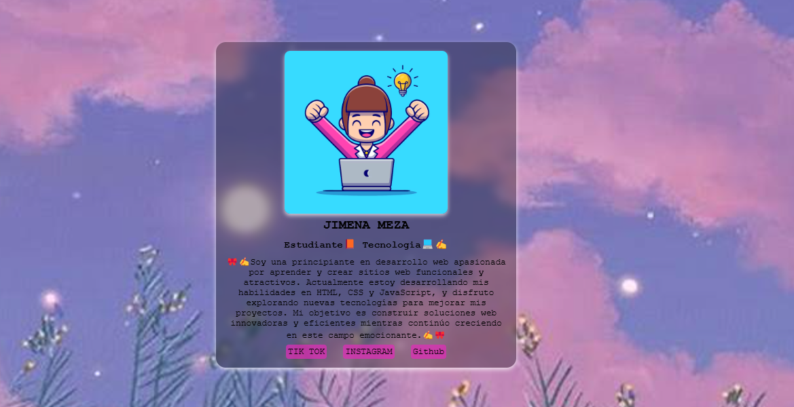

# MI PORTAFOLIO

## DESCRIPCION✍️
- Soy una principiante en desarrollo web apasionada por aprender y crear sitios web funcionales y atractivos. Actualmente estoy desarrollando mis habilidades en HTML, CSS y JavaScript, y disfruto explorando nuevas tecnologías para mejorar mis proyectos. Mi objetivo es construir soluciones web innovadoras y eficientes mientras continúo creciendo en este campo emocionante.✍️🎀

## 💻 Instalación 💻
- Ubicarse en la carpeta que contendrá el proyecto
Abrir terminal de comandos
git clone https://github.com/Jimemapedregal/jimena-card.git

- Abrir el proyecto con un servidor en un cliente.
  
## 📚 Tecnologías principales 📙✍️
| Tecnología      | Versión  | Descripción                    |
|:----------------|:---------|-------------:                  |
| HTML            |  5       |Lenguaje de Marcas de Hipertexto|
| CSS             |  3       |  Hojas de Estilo en Cascada    |
| Bootstrap Icons |  1.11.3  |  Conjunto de íconos vectoriales|

## 🎀 Redes sociales 🎀
- 🎀 TIK TOK: https://www.tiktok.com/@1am_jime?_t=8oiF3Fivcw9&_r=1🎀
- 🎀 GitHub: https://github.com/jimemapedregal 🎀
- 🎀INSTAGRAM:https://www.instagram.com/jimena_06_2005/?igsh=bm5qczNmZHo1azM1🎀
